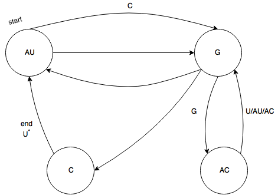
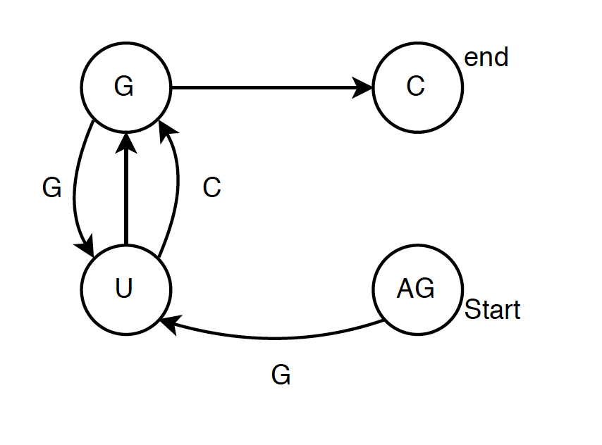
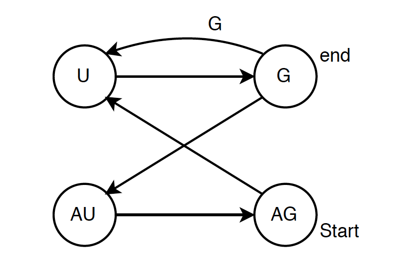

# RNAchain_reconstruction

<p align="left">The genetic information is stored by DNA and RNA chains. AN RNA chain is a sequence of bases whose length varies with the species. Each base can be one of the four: A = adenine, U = uracil, C = cytosine and G = guanine.
The problem of knowing the composition of RNA chain is still quite open as the sequences are extremely long.</p>

This program implements an algorithm that reconstructs the RNA chain out of two sets of fragments. 
 
[Full project description](https://github.com/olgakent/RNAchain_reconstruction/blob/master/rnachain.pdf)

To compile and run the program on terminal type:

    - make
    - ./RNAchain
    
To delete executables and object file type:

    -  make clean
    
### Example 1

Input:
```
    Enter G-enzyme fragments:AUCG,AUG,G,CU,ACUAUACG
    AU C G
    AU G
    G
    C U
    AC U AU AC G
    Enter UC-enzyme fragments:GGAC,U,AU,GAU,C,U,AC,GC,AU
    G G AC
    U
    AU
    G AU
    C
    U
    AC
    G C
    AU
```
Output:

```
    Possible chains:
    AUCGGACUAUACGAUGCU
    AUCGAUGGACUAUACGCU
    AUGGACUAUACGAUCGCU
    AUGAUCGGACUAUACGCU
```
<p align="left">Multigraph for the given fragments where each fragment becomes an arc from a vertex labeled with the beginning of the fragment to a vertex labeled with the end of the fragment:</p>
<p align="center"></p>

### Example 2
Input:
```
     Enter G-enzyme fragments: G,AG,UG,AG,UCG
     G
     AG
     U G
     AG
     U C G
     Enter UC-enzyme fragments: C,GC,GGU,AGGU
     C
     G C
     G G U
     AG G U
```
Output:
```
     Possible chains:
     AGGUGGUCGC
     AGGUCGGUGC
```
<p align="center"></p>

### Example 3
Input:
```
     Enter G-enzyme fragments: G,U,UG,UG,AUAG,UG,G
     G
     U
     U G
     U G
     AU AG
     U G
     G
     Enter UC-enzyme fragments: U,AGU,AGU,GAU,GGU
     U
     AG U
     AG U
     G AU
     G G U
```
Output:
```
     Possible chains:
     AGUGAUAGUGGUG
     AGUGGUGAUAGUG
```
<p align="center"></p>
